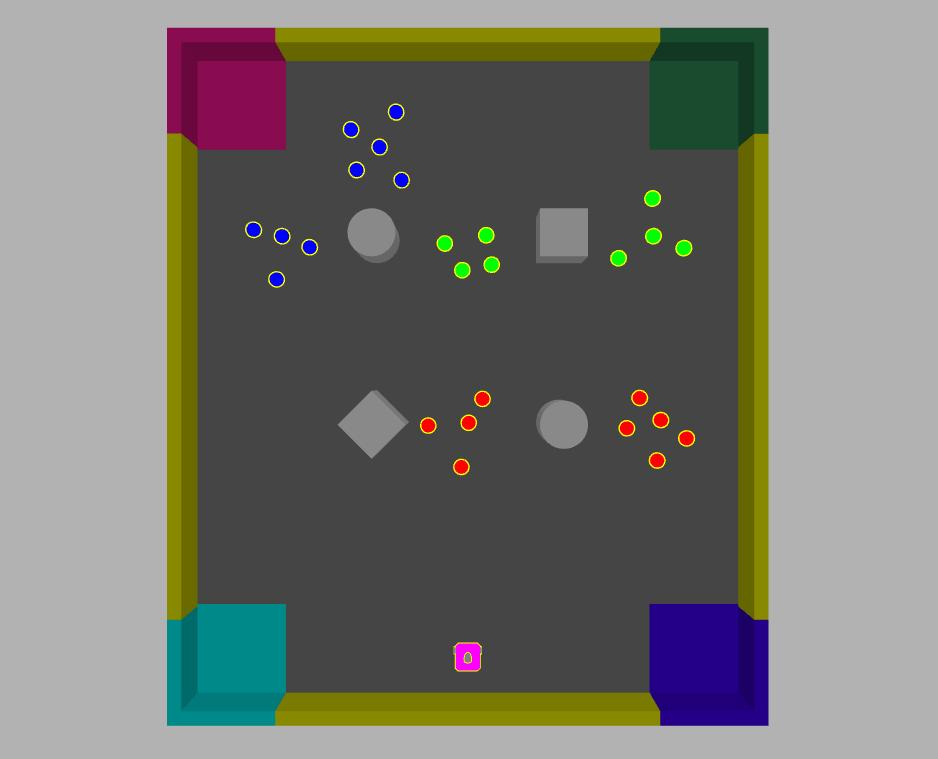

AURO Assessment ROS2 Package
----------------------------
This package contains the simulation configuration for the AURO assessment. There
is one simulation environment ROS node, `item_manager`, and three ROS nodes per
robot `item_sensor`, `robot_sensor` and `zone_sensor`.
Note that for the assessment you are **not allowed** to change their implementation.

# Task
Your implementation task, as described in the assessment paper, is to design and 
implement, an autonomous robotic system using TurtleBot3 Waffle Pi robots, running in 
simulation, that collect items in the arena and deposit them in appropriate zones. 

## Items and zones
There are three types of **items**, identified by distinct colours: red, green, and blue. Similarly,
there are, by default, four **zones**, where items can be deposited,  located in the four corners of the arena
and identified by distinct colours: cyan, purple, green, and pink. A screenshot of a simulation 
launched using the default parameters is reproduced below:

### Picking-up and offloading an item
Items can be picked up when close by using the ROS service `/pick_up_item`. Similarly, when a robot
holds an item it may offload it by using the ROS service `/offload_item`. Details of the ROS facilities
of the simulated environment are discussed further below.

### Depositing an item in a zone
To deposit an item, a robot must **offload** the item while over a zone. When an item is successfully 
deposited, it will be automatically replaced in the arena. 

Initially a zone can accept a deposit for an item of any colour, but 
**once an item has been deposited then only items of the same colour will be subsequently accepted** afterwards. 
In particular, this means that if an item is offloaded in a zone but cannot be deposited, then the 
item will stay on the arena floor. Note that an item may be offloaded anywhere in the arena, at any time.

# Simulation environment
A valid solution to the problem can make use of multiple robots, where each robot is
identified by a unique identifier `robotX`, where `X` is a number. For example, the 
default launch file [assessment_launch.py](launch/assessment_launch.py) uses one robot, 
whose identifier is `robot1`.

## Simulation environment nodes
The functionality of the nodes and their ROS interfaces are described in detail below.

### item_manager
This node keeps track of items in the simulated arena. 

It provides the ROS services `/pick_up_item` and `/offload_item`, for picking and offloading items
in the arena. Their interface type `ItemRequest` is defined in [../auro_interfaces/srv/ItemRequest.srv](../auro_interfaces/srv/ItemRequest.srv),
which must include in the request the identifier of the robot.

It also publishes the topics:
* `/item_log`: provides a log of how many items of each colour have been collected, so far.
* `/item_holders`: provides a view of the which item is held by what robot.

## Robot nodes
The following nodes are executed per robot, namespaced according to the robot's identifier. For
example, the topic `items` will be available as `/robot1/items` for `robot1`.

### item_sensor
This node processes the RGB camera image data and identifies items based on their colour.

It publishes the following topics:
* `items`: of type [`ItemList`](../assessment_interfaces/msg/ItemList.msg), it contains a list of the items 
  visible from the camera data, as processed by the sensor. For
  each item, recorded by the type [`Item`](../assessment_interfaces/msg/Item.msg) there is an estimate of its 
  relative offset with respect to the current view (x/y-axis), the perceived diameter and colour.
* `camera/image_items`: of type `Image`, it contains the camera image with the information about the visible
  items superimposed.

### robot_sensor
This node processes the RGB camera image data and identifies other robots based on their colour.

It publishes the following topics:
* `robots`: of type [`RobotList`](../assessment_interfaces/msg/RobotList.msg), contains a list of the perceived robots, each with an indication of
  their perceived size, and relative offset with respect to the current view (x/y-axis).
* `camera/image_robots`: of type `Image`, contains the camera image with the information about the visible
  robots superimposed.

### zone_sensor
This node processes the RGB camera image data and identifies zones based on their colour.

It publishes the following topics:
* `zone`: of type [`Zonelist`](../assessment_interfaces/msg/ZoneList.msg), contains a list of perceived zones, each with an indication of their
  perceived size, colour, and relative offset with respect to the current view (x/y-axis), as recorded by a message of type [`Zone`](../assessment_interfaces/msg/Zone.msg)
* `camera/image_zone`: of type Image, contains the camera image with the information about the visible
  zones superimposed.

## Launch files
A simulation can make use of multiple robots, whose starting positions are pre-defined
in [config/initial_poses.yaml](config/initial_poses.yaml). You are encouraged to check
in detail its arguments, eg. by running `ros2 launch assessment assessment_launch.py --show-args`.
In particular, the following options may be useful to specify different simulation scenarios:

* `num_robots`: Number of robots to spawn.
* `random_seed` : Random number seed for item manager, controlling the distribution of items.
* `sensor_noise` : Whether to enable sensor noise (applies to camera, LiDAR, and IMU).
* `obstacles`: Whether the world contains obstacles.
* `initial_pose_package` : Allows changing the node in which to look for the default pose configuration of the robot(s).
* `initial_pose_file` : Allows changing the yaml file containing the initial pose configuration of the robot(s), where this
   is relative to the package name passed to `initial_pose_package`.

The zones may be enabled or disabled depending on the simulation scenarios:

* `zone_top_left` : Whether to enable the top left zone.
* `zone_top_right` : Whether to enable the top right zone.
* `zone_bottom_left` : Whether to enable the bottom left zone.
* `zone_bottom_right` : Whether to enable the bottom right zone.

The simulation may be executed headless and faster than real-time, by controlling the following paremters:

* `headless` : Whether to run the Gazebo GUI.
* `limit_real_time_factor` : Whether to limit the Gazebo real-time factor to 1.0.

## Sample solution schema
A minimal code schema for a potential solution is included in the package [`solution`](../solution/). It
reuses the launch file `assessment_launch.py`, that launches the simulation environment.
